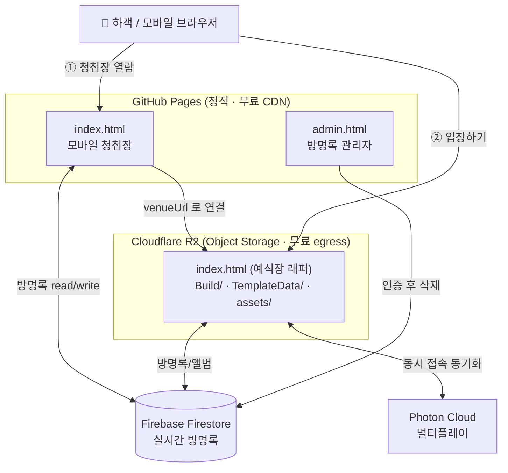

# 모바일 청첩장 × 3D 예식장 — AI 기반 개발 · 배포 자동화 프로젝트

> **AI 개발 도구(Claude Code)와 Cloud Object Storage(Cloudflare R2)를 활용해, 개발부터 빌드·배포까지 자동화한 웹 서비스 구축 경험**

이 저장소는 단순한 모바일 청첩장이 아니라, **AI 활용 개발 · 업무 자동화 · 클라우드 기반 운영 환경 구축** 경험을 보여주기 위한 포트폴리오 프로젝트입니다.

### 🔗 라이브 서비스 (모바일에서 열어보세요)

| 서비스 | 링크 |
|--------|------|
| 📱 **모바일 청첩장 (메인 진입)** | **https://biny0715.github.io/JSHWWedding_WebGL/** |
| 🏯 3D 예식장 (청첩장 `입장하기` → 자동 이동) | https://pub-e2f0473c1db44b0ea4d9059179c8ff75.r2.dev/index.html |

> 청첩장에서 **[입장하기]** 를 누르면 브라우저에서 바로 3D 한옥 예식장을 걸어 다닐 수 있습니다. (설치 불필요)

<p>
  
  
  
  
  
  
</p>

---

## 1. 프로젝트 소개

브라우저 설치 없이 동작하는 **모바일 청첩장 + 3D 인터랙티브 예식장** 웹 서비스입니다.
정적 페이지 한 장에 그치지 않고, **실시간 데이터 · 멀티플레이 3D · 자동 배포 파이프라인**을 갖춘 *실제 운영 가능한 서비스* 형태로 구축했습니다.

**제공 기능**

| 영역 | 기능 |
|------|------|
| 청첩장 | 인사말, 예식 일정/카운트다운, 갤러리, 계좌번호 복사, 오시는 길(네이버 지도 + 카카오/네이버/티맵 길찾기) |
| 방명록 | Firestore 기반 **실시간 방명록** 작성·열람, 관리자 인증 후 삭제(운영 도구) |
| 3D 예식장 | Unity WebGL로 만든 한옥 공간을 **멀티플레이로 입장**, 방명록·웨딩앨범을 공간 내에서 열람 |
| 캐릭터 | 입장 전 **부위별 커스터마이징**(성별·피부·의상·모자 등) — 웹 시트 UI ↔ Unity 3D 프리뷰 실시간 연동, 선택 룩으로 멀티플레이 입장 |
| NPC / 미니게임 | NPC 대화 시스템(전용 카메라 연출) · **보물찾기 퀘스트**(숨겨진 아이템 6종, 획득 시 일러스트 팝업) · 도움말 NPC |
| 축하 화환 | 퀘스트 완료 보상으로 **축하 화환 메시지**를 남기면 예식장 공간에 실시간 게시(15자리, onSnapshot 실시간 동기화) — 초과분도 저장·관리자 열람 |
| 운영 | 콘텐츠 단일 설정 파일 관리, 모바일 복귀/저전력 대응, 끊김 사유 안내, 관리자 도구(방명록/화환) 등 **운영 친화 설계** |

> 핵심 차별점: "웹페이지 제작"이 아니라, **무게가 다른 두 자산(가벼운 청첩장 / 무거운 3D 빌드)을 어떻게 안정적·저비용으로 배포·운영할 것인가**를 푼 인프라 프로젝트입니다.

---

## 2. 개발 배경 및 목표

- **배경**: 직접 만든 모바일 청첩장에 3D 예식장을 결합하면서, Unity WebGL 빌드(단일 파일 45MB+, 전체 56MB)가 일반 정적 호스팅의 **파일 용량·트래픽 한도**에 부딪혔습니다.
- **문제 인식**: 빌드할 때마다 *여러 폴더 복사 → 호스트 업로드 → 설정 동기화 → 검증* 을 손으로 반복했고, 단계 누락·휴먼 에러가 잦았습니다. 초기 호스트(Netlify)는 **무료 대역폭이 반복 소진**되어 예식 당일 다운 위험이 있었습니다.
- **목표**:
  1. 반복적인 빌드/배포 작업을 **한 번의 명령으로 재현 가능하게** 자동화한다.
  2. 대용량 자산을 **비용 0(무료 무제한 트래픽)** 으로 안정적으로 서빙한다.
  3. AI 개발 도구를 코드 작성뿐 아니라 **인프라 설계·자동화·검증**에까지 적극 활용해 개발 생산성을 끌어올린다.

---

## 3. Tech Stack — *왜 선택했는가*

| 분류 | 기술 | 선택 이유 |
|------|------|-----------|
| **언어** | C#, JavaScript(ESM), HTML/CSS, PowerShell | 3D는 C#(Unity), 웹 레이어는 프레임워크 없는 Vanilla JS로 **로딩 무게 최소화**(모바일 청첩장 특성), 배포는 PowerShell로 스크립트화 |
| **3D / 멀티플레이** | Unity WebGL, Photon PUN | 설치 없이 브라우저에서 3D 공간 + 다중 접속 하객을 같은 방에 표현 |
| **AI 개발 도구** | **Claude Code** | 단순 코드 생성이 아니라 **인프라 의사결정 → 자동화 스크립트 작성 → 실행 → 검증**까지 담당하는 *DevOps 코파일럿*으로 활용 |
| **AI ↔ 엔진 연동** | **MCP (Unity MCP Server)** | Claude Code가 **Unity 에디터를 직접 제어**(씬 열기·컴포넌트 수정·빌드 설정·스크린샷)하게 해, GUI 수작업을 AI 자동화로 대체 |
| **대용량 호스팅** | **Cloudflare R2** | 정적 호스팅의 *파일당 용량 한도*를 우회하는 오브젝트 스토리지 + **egress(아웃바운드) 무료** → 트래픽 비용 0, 단일 오리진이라 CORS 불필요 |
| **정적 호스팅** | GitHub Pages | 가벼운 청첩장은 **git push → 자동 게시(CD)** 로 충분, 무료 CDN |
| **배포 엔진** | rclone | R2의 S3 호환 API에 **변경분만 증분·병렬 업로드** |
| **데이터(서버리스)** | Firebase Firestore / Auth | 서버 운영 없이 실시간 방명록 + 보안 규칙으로 권한 분리 |
| **지도** | Naver Maps (NCP), Kakao/Naver/Tmap Deep Link | 위치 표시 + 모바일 앱 길찾기 바로 연결 |

> **선택의 일관된 기준**: *"운영 인력 0 · 비용 0 · 한 명령 재현"* — 1인 운영 제약을 인프라 선택의 1순위 기준으로 삼았습니다.

---

## 4. AI 기반 개발 Workflow

Claude Code와 MCP를 **개발 생산성 향상 도구**로 활용해, 사람은 *의사결정*에 집중하고 반복 작업은 AI에 위임했습니다.

```
사람: "예식장 빌드가 너무 무겁고 배포가 번거롭다"
  │
  ├─▶ [Claude Code]  문제 진단 → 호스팅 분리 아키텍처 설계 제안
  │
  ├─▶ [Claude Code]  멱등 배포 스크립트(deploy-venue.ps1) 작성 + rclone(R2) 구성
  │
  ├─▶ [MCP / Unity]  에디터 직접 제어 — 씬 편집·컴포넌트 수정·빌드 설정·스크린샷 검증
  │
  └─▶ [Claude Code]  배포 실행 후 HEAD 요청으로 라이브 검증 + 두 repo 설정 동기화
```

**AI를 활용해 개선한 반복 작업**

- **코드 작성/수정**: 웹↔Unity 브리지(`SendMessage`/`.jslib`), 방명록·화환 모듈, 로딩/복귀 처리 등 반복 패턴 코드를 AI와 함께 빠르게 구현·리팩터링.
- **엔진 GUI 작업의 자동화**: 본래 Unity 에디터에서 마우스로 하던 작업(씬 편집, 컴포넌트 값 설정, 애니메이터 상태머신 구성, 지형 정합 배치, 화면 검증)을 **MCP를 통해 AI가 직접 수행** → 반복 클릭 제거. 예: 아이들 애니메이션 변형 시스템은 에디터 도구 작성 → MCP 실행 → 직렬화 파일 검증까지 전 과정을 AI가 수행.
- **빌드 최적화의 코드화**: 텍스처 최적화 규칙을 에디터 스크립트로 정리해, 빌드 용량 **134MB → 56MB (−58%)** 회귀를 도구로 억제.
- **배포·검증 루프**: "빌드 → 한 명령 배포 → 자동 검증"을 AI가 일관 수행 → 휴먼 에러·인지 부하 감소.
- **멀티에이전트 디버깅**: 기기 의존(아이폰 14 Pro) **간헐 UI 소실 버그**를 병렬 조사 에이전트 여러 개 + 판정 에이전트로 다각도 분석 → 렌더링 가설 3회 실패 후 진짜 원인(미해제 폴백 타이머)을 규명·수정. 재발 대비 계측 로그까지 심어 *재현 불가 버그도 추적 가능한 상태*로 마감.

> 결과적으로 Claude Code는 *코드 생성기*가 아니라 **설계·자동화·검증을 함께 수행하는 개발 파트너**로 기능했고, 1인으로도 인프라까지 갖춘 서비스를 운영 가능한 수준으로 만들 수 있었습니다.

---

## 5. 배포 자동화 구조

```
   개발 (코드/콘텐츠 수정, Unity 씬 작업)
     │
     ▼
   Claude Code  ── 배포 절차 오케스트레이션 / MCP로 Unity 제어
     │
     ▼
   Build  (Unity WebGL 빌드 → D:\Build)
     │
     ▼
   Cloudflare R2 업로드  (rclone, 변경분만 증분 전송)
     │
     ▼
   서비스 배포  (공개 URL 반영 → HEAD 요청으로 검증)
```

서비스 성격에 따라 **두 경로**로 배포됩니다.

**경로 A — 청첩장(가벼운 변경): 진짜 Continuous Deployment**
`git push (main)` → GitHub Pages 자동 빌드·게시 → 라이브 반영 *(추가 작업 0)*

**경로 B — 3D 예식장(Unity 빌드): 단일 명령 멱등 배포 (`deploy-r2.ps1`)**
1. 기본 모드: Unity 빌드 산출물(`Build/`, `TemplateData/`)만 `rclone sync → r2:jshw-venue` — **체크섬 비교로 변경분만 업로드**
2. `-Web` 모드: 웹 레이어(`index.html` + `assets/`)만 별도 배포 — **빌드/웹 레이어를 분리 배포**해 서로를 덮어쓸 수 없게 정책화
3. 웹 레이어 원본은 Unity 저장소(`WebHost/`)에서 **git으로 버전관리** → 배포 스크립트·웹 소스 모두 재현 가능

### Before / After

| 구분 | Before (수동) | After (자동화) |
|------|--------------|----------------|
| 트래픽 비용 | 무료 한도 초과·다운 위험 (Netlify 100GB) | **R2 egress 무료·무제한** |
| 배포 절차 | 폴더 3곳 수동 복사 + 업로드 | **`deploy-venue.ps1` 1회 실행** |
| 업로드량 | 매번 전체(56MB) 재업로드 | **변경분만 증분 전송** (예: 7개 파일) |
| 누락 위험 | 사람이 단계 기억 | 스크립트가 절차 캡슐화 (멱등) |
| 빌드 용량 | 134MB | 텍스처 최적화로 **56MB (−58%)** |

> **개선점 요약**: 다단계 수작업 → *한 명령*, 전체 재업로드 → *증분*, 비용 초과 → *0*, 휴먼 에러 다발 → *재현 가능한 절차*.

---

## 6. 시스템 구조



**핵심 설계 — 무게별 호스팅 분리**: Unity 빌드 단일 파일이 GitHub Pages(100MB/파일)·Cloudflare Pages(25MiB/파일) 한도를 초과 → **가벼운 청첩장은 Pages, 무거운 3D는 R2 오브젝트 스토리지**로 분리하고 `config.js`의 `venueUrl` 한 줄로 연결.

---

## 7. 주요 구현 기능

- **UI/UX**: 동물의숲+한옥 무드의 청첩장, 카운트다운·갤러리·계좌 복사. 예식장은 **Unity 캔버스(배경) + HTML 오버레이(컨트롤)** 하이브리드 레이어 — `pointer-events` 분리로 3D 터치와 UI 터치 충돌 방지.
- **반응형 화면**: 모바일 우선 레이아웃, `svh`/`dvh`·safe-area(`viewport-fit=cover`) 대응, iOS 더블탭 줌 차단(`touch-action: manipulation`), 모바일 키보드 입력 이슈(WebGLInput) 처리.
- **캐릭터 커스터마이징**: 하단 시트 UI에서 부위 선택 → `SendMessage`로 Unity 프리뷰 즉시 반영, 룩 문자열 하나로 직렬화해 입장 시 멀티플레이 동기화. 부위별 파트를 런타임 조립(어셈블러)하는 구조.
- **NPC 대화 시스템**: NPC 접근 시 월드 캔버스 버튼 → 클릭 시 **전용 대화 카메라 즉시 컷**(NPC별 구도 파라미터) + 웹 대화창. 대화 종류(퀘스트/도움말/축하인사)를 모드로 분기.
- **보물찾기 퀘스트 + 축하 화환**: 상태 소유권을 3층으로 분리 — 진행 상태는 Unity(인메모리), 완료 여부는 기기(localStorage, 디바이스당 1회), 화환은 Firestore(onSnapshot 실시간). 획득 아이템 6종은 **직접 그린 SVG 일러스트** 팝업으로 연출, 화환 15자리는 작성 순서로 공간에 게시되고 근접 시 열람 버튼 표시.
- **아이들 애니메이션 변형**: 캐릭터가 부위별 Animator 여러 개로 구성된 구조에서, 루트 지휘자가 랜덤 변형(둘러보기/릴랙스)을 **모든 파트에 같은 프레임에 CrossFade** → 부위 간 동작·위상 동기화.
- **데이터 관리**: 콘텐츠/사진/계좌/좌표를 **`config.js` 한 곳(SSOT)** 에서 관리. 방명록·화환은 Firestore에 저장, 보안 규칙으로 필드·길이 검증 및 권한 분리, 페이징·실시간 반영.
- **배포 관련 기능**: 멱등 배포 스크립트(`deploy-r2.ps1` — 빌드/웹 분리 배포), rclone 증분 업로드, R2 단일 오리진 서빙, 배포 후 원격 검증.
- **운영 친화 기능**: 이름 기억 → **자동 재입장**(iOS 백그라운드 복귀 대응), 접속 지연 시 안내+새로고침, **끊김 사유 화면 노출**, 관리자 인증 삭제 도구(방명록/화환), UI 소실 대비 **계측 로그**(숨김 스택 추적·뷰포트 상태·WebGL 컨텍스트 손실).

---

## 8. 문제 해결 경험

| 영역 | 문제 | 해결 |
|------|------|------|
| **배포** | Unity 빌드 단일 파일이 정적 호스팅 파일 용량 한도 초과 | **호스팅 분리**(Pages + R2 오브젝트 스토리지)로 한도 우회 |
| **운영(트래픽)** | Netlify 무료 100GB 대역폭 반복 소진 → 당일 다운 위험 | **Cloudflare R2(egress 무료) 마이그레이션** + 엣지 캐시로 흡수 |
| **반복 작업** | 빌드마다 다단계 복사/업로드/검증의 휴먼 에러 | **멱등 단일 명령 + 증분 업로드**로 절차 캡슐화 |
| **환경 설정** | R2(S3 호환) 인증·엔드포인트·토큰 권한 범위 구성 | rclone 리모트 구성, **최소 권한 토큰**(Object R/W) 적용 |
| **빌드 용량** | 텍스처 과다로 빌드 134MB | 텍스처 최적화 규칙화로 **56MB(−58%)** |
| **모바일 운영** | iOS 저전력에서 무한 로딩/입장 직후 튕김 | 지연 안내·새로고침, **끊김 사유 웹 노출**, 자동 재입장 |
| **간헐 버그** | 아이폰에서 커스터마이징 시트가 **간헐적으로 소실**(재현 조건 불명, 렌더링 계열 수정 3회 실패) | 멀티에이전트 병렬 조사로 상태머신·타이머 전수 감사 → **미해제 25초 폴백 타이머**가 원인임을 규명. 타이머 정리 + 진입 가드 + 뷰포트 복구 워치독 + 계측 로그의 다층 방어로 해결 |
| **애니메이션** | 부위별 Animator 구조에서 아이들 변형이 **부위마다 제각각 재생**(파트별 랜덤의 구조적 한계) | 파트별 랜덤을 폐기하고 **루트 지휘자 방식**(단일 추첨 → 전 파트 동시 CrossFade)으로 재설계 → 동작·위상 동기화 |
| **AI 도구 연동** | Unity MCP 서버가 좀비 프로세스의 포트 점유로 **반복 연결 실패** | 포트 점유 프로세스 추적으로 원인(소켓 핸들 상속) 파악, **기동 순서 절차화**(Unity 먼저 → IDE)로 재발 차단 |
| **유지보수** | 콘텐츠 수정 위치 분산 | **단일 설정 파일(SSOT)** 로 수정 지점 일원화 |

**정직한 한계 / 다음 단계**: 배포 *절차*는 자동·멱등이지만 *시작 트리거*는 수동(빌드 후 실행)입니다. ~~웹 래퍼·배포 스크립트가 로컬 전용~~ → 이후 **웹 레이어 원본(`WebHost/`)과 배포 스크립트를 Unity 저장소로 이관·버전관리**해 해소했습니다. 남은 개선 계획은 **빌드 훅 트리거 연결, 커스텀 도메인(r2.dev rate-limit 제거)** 입니다.

---

## 9. 프로젝트를 통해 얻은 경험

- **AI 활용 개발**: Claude Code + MCP로 코드 작성을 넘어 **인프라 설계·엔진 GUI 작업·배포·검증까지** AI에 위임 → 1인으로 인프라 포함 서비스를 운영 수준으로 구축.
- **디버깅 방법론**: 재현 조건이 불명확한 간헐 버그에서 증상(렌더링) 가설보다 **상태 전이 경로·타이머 전수 감사와 계측 심기**가 우선임을 체득 — 수정 실패를 반복하는 대신 멀티에이전트로 가설을 병렬 검증해 근본 원인에 도달.
- **자동화**: 다단계 수작업을 **멱등·증분 단일 명령**으로 캡슐화해 휴먼 에러와 인지 부하를 제거.
- **클라우드 기반 운영**: 오브젝트 스토리지(R2) 특성을 이용한 **대용량·무료 트래픽 서빙**, 호스팅 분리 아키텍처, 서버리스(Firestore) 데이터 운영, 보안 규칙·최소 권한 토큰·도메인 화이트리스트 설계.
- **개발 생산성 개선**: 배포 리드타임 단축, 빌드 용량 −58%, 트래픽 비용 0 — *문제 발견 → 자동화 설계 → 운영 가능한 형태로 개선* 의 전 과정 경험.

---

## 10. 한 줄 요약

> **"AI 기반 개발 도구(Claude Code · MCP)와 Cloud Object Storage(Cloudflare R2)를 활용하여, 개발부터 빌드·배포·검증까지 자동화한 웹 서비스 구축 및 클라우드 운영 환경 구축 경험"**

---

### 보안 노트
공개 저장소에 포함된 키(Firebase Web API Key, 네이버 지도 Client ID)는 **설계상 공개 가능한 키**로, Firestore 보안 규칙과 도메인 화이트리스트로 보호됩니다. R2 업로드 토큰 등 실제 비밀 자격증명은 **저장소에 커밋되지 않습니다**(로컬 전용 · `.gitignore`).

### 로컬 미리보기
```bash
npx serve .          # 정적 서버
# 또는
node server.js       # http://localhost:8080 (압축 빌드 헤더가 필요할 때)
```
